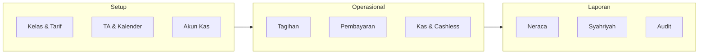
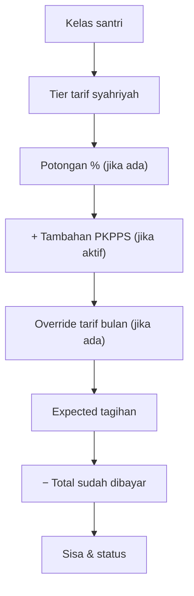
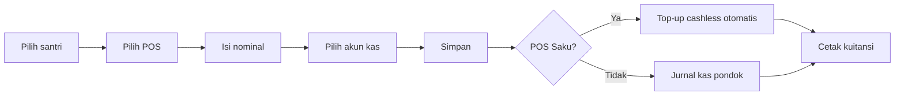

# Panduan Keuangan Lengkap — PWA Nailul Muna

Dokumen referensi operator modul keuangan pondok.  
Versi panduan in-app ringkas: `/keuangan/panduan.php`

---

## Daftar Isi

1. [Pendahuluan](#0-pendahuluan)
2. [Setup Awal](#1-setup-awal-wajib-sebelum-operasional)
3. [Syahriyah & Tagihan Bulanan](#2-syahriyah--tagihan-bulanan)
4. [Awal Tahun & Tagihan Khusus](#3-awal-tahun--tagihan-khusus)
5. [Input Pembayaran (Bendahara)](#4-input-pembayaran-bendahara)
6. [Portal Wali (Pembayaran Online)](#5-portal-wali-pembayaran-online)
7. [Kas Umum](#6-kas-umum-pemasukan--pengeluaran)
8. [Alokasi Dana](#7-alokasi-dana-cara-pakai-praktis)
9. [Saku & Cashless](#8-saku--cashless)
10. [Laporan Keuangan](#9-laporan-keuangan)
11. [Payroll Pembimbing](#10-payroll-pembimbing)
12. [Keuangan BOS](#11-keuangan-bos-modul-terpisah)
13. [WA Tagihan Otomatis](#12-wa-tagihan-otomatis)
14. [Impor/Ekspor & Offline](#13-importekspor--offline)
15. [Troubleshooting & Audit](#14-troubleshooting--audit)
16. [FAQ & Glosarium](#15-faq--glosarium)

---

## 0. Pendahuluan

### Untuk siapa panduan ini?

| Peran | Akses keuangan |
|-------|----------------|
| **Admin** | Penuh: transaksi, laporan, pengaturan, payroll, perbaikan |
| **Pengurus / bendahara** | Sesuai izin yang diberikan admin (bisa dibatasi per menu) |
| **Petugas absensi** | Hanya scan cashless dan cetak kuitansi |
| **Wali santri** | Portal wali: lihat tagihan, bayar online, kuitansi, saldo saku |
| **Pembimbing** | Tidak ada menu keuangan |

### Konsep penting

**Tagihan bulanan tidak disimpan sebagai invoice tetap.** Sistem **menghitung otomatis** setiap kali dibuka, berdasarkan:

- Pengaturan tarif
- Kelas keuangan santri
- Potongan, PKPPS, override per bulan
- Riwayat pembayaran

Yang **benar-benar tercatat** di database:

- **Pembayaran** santri (per pos/komponen)
- **Pengeluaran** operasional
- **Pemasukan** lain (donasi, hibah)
- **Jurnal akuntansi** otomatis

**POS wajib bulanan:** hanya **syahriyah**. Makan dan saku bersifat **opsional** — tidak menentukan status lunas wajib.

### Peta menu keuangan

#### Grup **Keuangan**

| Bagian | Halaman utama |
|--------|---------------|
| **Ringkasan** | Dashboard, Neraca, Arus Kas, Rekap Kas Bulanan, Data Offline, Rekap per POS |
| **Transaksi** | Tagihan & Pembayaran, Cek Pembayaran, Kas Umum, Riwayat, Impor/Ekspor, Perbaikan Kas, Potongan, Talangan |
| **Laporan Syahriyah & Gaji** | Laporan Syahriyah, Kartu Pembayaran Santri, KOPSA per Santri, Payroll Pembimbing |
| **Pengaturan** | Pengaturan Keuangan, Panduan, Inventaris, Santri Bulanan |

#### Grup **Saku & Cashless**

Dashboard Saku, Laporan Koperasi, Rekap Saldo & PIN, Top Up/Scan, Setor Harian, Perbaikan Saku.

#### Grup **Keuangan BOS**

Modul terpisah untuk dana BOS PKPPS (bukan kas pondok umum).

### Alur besar modul



---

## 1. Setup Awal (wajib sebelum operasional)

Lakukan urutan berikut **sebelum** TA baru atau sebelum menerima pembayaran pertama.

### 1.1 Kelas keuangan

**Halaman:** `/settings/kelas_keuangan.php`

**Tujuan:** Menentukan tier tarif setiap santri (Muadalah / Wustho / Ulya).

| Field | Penjelasan |
|-------|------------|
| **Kode** | Disimpan di data santri sebagai kategori kelas keuangan |
| **Nama tampilan** | Label di form dan laporan |
| **Tier tarif** | Muadalah, Wustho, atau Ulya — menentukan kolom tarif yang dipakai |
| **Urutan** | Urutan di dropdown |
| **Aktif** | Nonaktif = tidak muncul untuk santri baru, tapi kode lama tetap dipakai billing |

**Tips:** Pastikan setiap santri punya kategori kelas keuangan yang valid sebelum cek tagihan.

**Kesalahan umum:** Mengganti kode kelas tanpa memperbarui data santri — gunakan fitur rename yang cascade otomatis.

---

### 1.2 Jenis syahriyah

**Halaman:** `/settings/kelas_syahriyah.php`

**Tujuan:** Label jenis syahriyah per kelas keuangan (untuk kartu syahriyah dan laporan).

> **Penting:** Jenis syahriyah **tidak menambah nominal tagihan**. Nominal dari tier tarif + PKPPS + potongan.

---

### 1.3 Tahun ajaran & periode

**Halaman:** `/keuangan/pengaturan.php?bagian=umum`

| Pengaturan | Fungsi |
|------------|--------|
| **Tahun ajaran aktif** | Semua tagihan, pembayaran, dan laporan bulanan terikat TA ini |
| **Tagihan mulai tanggal masuk** | Santri baru ditagih bulanan mulai bulan masuk (bukan dari bulan 1) |
| **Bedakan awal tahun baru vs lama** | Tarif dan komponen awal tahun berbeda untuk santri baru dan lama |

**Santri baru vs lama — ringkas:**

| Jenis | Bulanan | Awal tahun |
|-------|---------|------------|
| **Santri baru** | Mulai bulan tanggal masuk | Tarif/komponen «baru» |
| **Santri lama** | Penuh 12 bulan TA | Tarif/komponen «lama» |

Pastikan setiap santri punya **tanggal masuk** di data santri jika opsi di atas aktif.

---

### 1.4 Kalender tagihan

**Halaman:** `/settings/kalender.php` (atau Kalender & TA)

**Tujuan:** Menentukan slot bulan tagihan (Hijriyah dan/atau Masehi) yang dipakai sistem.

Tanpa kalender tagihan yang benar, bulan tagihan syahriyah bisa tidak sesuai jadwal pondok.

---

### 1.5 Tarif & komponen

**Halaman:** `/keuangan/pengaturan.php?bagian=tarif`

Sub-bagian:

| Sub | Isi |
|-----|-----|
| **Syahriyah & makan default** | Matriks tarif per tier (Muadalah/Wustho/Ulya) |
| **Tarif per bulan** | Override nominal tertentu per bulan TA |
| **Tambahan PKPPS** | Nominal tambahan syahriyah untuk santri aktif PKPPS |
| **Makan per kelas** | Override tarif makan per kode kelas keuangan |
| **Saku & awal tahun** | Pendaftaran, bangunan, seragam, koperasi, LKS, HIS, dll. |
| **POS awal tahun aktif** | Centang komponen mana yang muncul di form pembayaran (baru/lama) |

**Tips PKPPS:** Nominal PKPPS ditambahkan ke syahriyah dasar, bukan tagihan terpisah. Alokasinya masuk komponen gaji guru (umum).

---

### 1.6 Alokasi dana

**Halaman:** `/keuangan/pengaturan.php?bagian=alokasi`

Tiga jenis alokasi (tab terpisah):

1. **Syahriyah** — pembagian % dari koleksi syahriyah (gizi, operasional, KOPSA, dll.)
2. **Awal tahun** — pembagian % dari pembayaran awal tahun
3. **Makan** — pembagian % dari pembayaran pos makan

Total persen aktif **maksimal 100%** per jenis.

Alokasi = **pagu virtual** untuk pelacakan, bukan transfer otomatis antar rekening.

---

### 1.7 Akun kas/bank

**Halaman:** `/keuangan/pengaturan.php?bagian=akun`

| Field | Penjelasan |
|-------|------------|
| **Jenis** | KAS (tunai/e-wallet), BANK, E-WALLET |
| **Nama akun** | Label di form pembayaran |
| **Saldo awal** | Mode legacy: saldo pembuka; mode transaksi: mulai dari nol |
| **Default** | Akun pre-selected saat input pembayaran |
| **Aktif** | Hanya akun aktif muncul di transaksi |

Setiap pembayaran dan pengeluaran **wajib** terhubung akun agar neraca akurat.

---

### 1.8 Midtrans (opsional — bayar online wali)

**Halaman:** `/settings/midtrans.php`

| Field | Fungsi |
|-------|--------|
| Aktif/nonaktif | Toggle pembayaran online portal wali |
| Server key / Client key | Kredensial Midtrans |
| Akun tujuan | Rekening kas yang menerima jurnal pembayaran online |

Setelah aktif, wali bisa bayar via QRIS/Virtual Account di portal wali.

---

### Checklist setup sebelum TA baru

- [ ] Tahun ajaran aktif sudah diperbarui
- [ ] Kelas keuangan dan tier tarif sudah benar
- [ ] Tarif syahriyah, makan, saku, awal tahun sudah diisi
- [ ] Tarif per bulan (jika ada kenaikan mid-TA) sudah diatur
- [ ] PKPPS tambahan sudah diset nominalnya
- [ ] Alokasi dana syahriyah/makan/awal tahun total ≤ 100%
- [ ] Akun kas/bank aktif dan default sudah benar
- [ ] Kalender bulan tagihan sudah sesuai
- [ ] Aturan santri baru vs lama sudah dicek
- [ ] Midtrans (jika dipakai) sudah ditest sandbox/production
- [ ] Cron WA tagihan sudah jalan (lihat [bagian 12](#12-wa-tagihan-otomatis))

---

## 2. Syahriyah & Tagihan Bulanan

### Tujuan

Memantau status pembayaran syahriyah (dan opsional makan/saku) per santri per bulan.

### Halaman utama

| Halaman | URL | Fungsi |
|---------|-----|--------|
| Status tagihan | `/pembayaran/tagihan_syahriyah.php` | Daftar santri + status per bulan |
| Cek pembayaran | `/pembayaran/cek_pembayaran.php` | Detail satu santri per bulan |
| Input pembayaran | `/keuangan/pembayaran.php` | Catat bayar |

### Rumus tagihan (mental model)



**Rumus singkat:**

```
Expected = (Tarif tier − potongan%) + tambahan PKPPS
Sisa = Expected − sudah dibayar
```

### Status tagihan

| Status | Arti |
|--------|------|
| **Lunas** | Syahriyah wajib sudah terpenuhi untuk bulan tersebut |
| **Sebagian** | Ada pembayaran tapi belum cukup |
| **Belum** | Belum ada pembayaran syahriyah |

> Makan dan saku **tidak** mempengaruhi status lunas wajib.

### Langkah memantau tagihan bulan ini

1. Buka **Status Tagihan Bulanan** (`/pembayaran/tagihan_syahriyah.php`)
2. Pilih **bulan tagihan** yang sesuai kalender pondok
3. Filter status: belum lunas / sebagian / lunas
4. Klik santri untuk detail atau langsung ke input pembayaran
5. (Opsional) Kirim pengingat WA manual dari baris santri

### Potongan syahriyah per santri

**Halaman:** `/keuangan/pengaturan.php?bagian=santri_bulanan&sub=potongan`

- Potongan dalam **persen (0–100%)** hanya untuk pos syahriyah
- Bisa dijeda sementara (bulan jeda potongan tidak mengurangi tagihan)
- Contoh: potongan 25% → syahriyah Rp 400.000 menjadi Rp 300.000

### Makan & saku per santri (opsional)

**Halaman:** `/keuangan/pengaturan.php?bagian=santri_bulanan&sub=opsional`

| Opsi | Fungsi |
|------|--------|
| Aktif/nonaktif makan | Santri tidak ditagih makan jika nonaktif |
| Aktif/nonaktif saku | Santri tidak ditagih saku jika nonaktif |
| Nominal custom | Override tarif default per santri |

### Santri baru — hal khusus

Jika **«Tagihan mulai tanggal masuk»** aktif:

- Bulan sebelum tanggal masuk: expected = 0
- Bulan masuk dan seterusnya: expected normal sesuai tier

**Cek:** tanggal masuk santri di menu Data Santri.

### Tips operator

- Refresh laporan setelah ubah tarif/potongan: tambahkan `?refresh=1` di URL laporan
- Tagihan WA otomatis hanya untuk syahriyah belum lunas
- Gunakan **Cek Pembayaran** untuk konfirmasi ke wali sebelum input manual

### Kesalahan umum

| Masalah | Penyebab | Solusi |
|---------|----------|--------|
| Tagihan santri baru terlalu tinggi | Tanggal masuk kosong/salah | Perbaiki tanggal masuk |
| PKPPS tidak muncul | Santri tidak aktif di PKPPS | Cek data PKPPS santri |
| Potongan tidak berlaku | Potongan nonaktif atau bulan jeda | Cek pengaturan potongan |
| Tier salah | Kategori kelas keuangan salah | Update di data santri |

---

## 3. Awal Tahun & Tagihan Khusus

### Awal tahun (komponen masuk TA)

Komponen umum (bisa diaktifkan per santri baru/lama):

- Pendaftaran, bangunan, seragam, koperasi, rak lemari, LKS, HIS, raport, KIS, dll.

**Pengaturan tarif:** `/keuangan/pengaturan.php?bagian=tarif` (bagian Saku & Awal Tahun)

**Pengaturan POS aktif:** centang komponen mana yang muncul di form bayar untuk santri baru vs lama.

### Cek pembayaran gabungan

**Halaman:** `/pembayaran/cek_pembayaran.php`

Gunakan filter **jenis**:

- Bulanan saja
- Awal tahun saja
- Gabungan (bulanan + awal tahun)

Berguna saat wali menanyakan total kewajiban santri.

### Tagihan khusus ke wali

**Halaman:** `/keuangan/tagihan_wali.php` (via hub Transaksi)

Untuk tagihan di luar syahriyah rutin — misalnya biaya kegiatan khusus, denda, atau tagihan ad-hoc ke wali tertentu.

**Langkah:**

1. Buat tagihan khusus dengan nominal dan keterangan
2. Wali melihat di portal: tab **Tagihan Lain**
3. Pembayaran dicatat seperti pembayaran biasa

---

## 4. Input Pembayaran (Bendahara)

### Tujuan

Mencatat uang masuk dari wali/santri ke sistem keuangan pondok.

### Halaman

**Input pembayaran:** `/keuangan/pembayaran.php`

### Langkah demi langkah

1. **Cari santri** — ketik nama/NIS/QR
2. **Pilih POS (pos pembayaran)** — syahriyah, makan, saku, atau komponen awal tahun
3. **Pilih bulan** (untuk POS bulanan) atau biarkan kosong (awal tahun)
4. **Isi nominal** — sistem validasi: tidak boleh melebihi sisa tagihan per pos
5. **Pilih akun kas/bank** tujuan (tunai/transfer)
6. **Simpan** → redirect ke kuitansi



### POS Saku — khusus

Pembayaran pos **Saku** tidak masuk kas operasional pondok langsung:

- Uang dicatat sebagai **titipan saku** santri
- Saldo cashless santri **naik otomatis**
- Santri bisa scan jajan di koperasi

Jika saldo tidak naik setelah bayar saku, lihat [Troubleshooting](#142-saku-bayar-tapi-saldo-tidak-naik).

### Kuitansi

| Halaman | Fungsi |
|---------|--------|
| `/keuangan/kuitansi.php` | Cetak kuitansi setelah bayar |
| `/keuangan/verifikasi_kuitansi.php` | Verifikasi publik (tanpa login) via kode/QR |

Berikan kuitansi ke wali sebagai bukti resmi.

### Riwayat & koreksi

**Halaman:** `/pembayaran/riwayat.php`

- Lihat semua pembayaran tercatat
- **Koreksi/edit** membutuhkan token edit (dari admin)
- Edit/hapus akan **membalik jurnal** akuntansi terkait

**Tips koreksi:**

- Jangan input ulang sebagai pembayaran baru — gunakan koreksi resmi
- Catat alasan koreksi untuk audit

### Kesalahan umum

| Kesalahan | Dampak | Solusi |
|-----------|--------|--------|
| POS salah | Alokasi dan jurnal salah | Koreksi via riwayat |
| Nominal melebihi tagihan | Ditolak sistem (atau anomaly di data lama) | Cek sisa tagihan dulu |
| Akun kas tidak dipilih | Neraca tidak balance | Perbaikan Kas |
| Bayar saku tanpa cek saldo | Wali komplain saldo 0 | Backfill top-up (troubleshooting) |

---

## 5. Portal Wali (Pembayaran Online)

### Tujuan

Wali santri melihat tagihan dan membayar tanpa datang ke bendahara.

### Login

**URL:** `/wali/login.php` (NIS atau nama santri + PIN portal wali). Production: `https://wali.nailulmuna.id/wali/login.php` (set `wali_public_url` di `config/app.local.php`).

### Tab di Portal Keuangan

**Halaman:** `/wali/keuangan.php`

| Tab | Isi |
|-----|-----|
| **Ringkasan** | Total tagihan vs bayar TA, saldo saku, breakdown POS |
| **Tagihan** | Tabel bulanan syahriyah (+ makan/saku jika aktif) |
| **Tagihan Lain** | Tagihan khusus/ad-hoc |
| **Bayar** | Riwayat bayar + tombol bayar online |

### Bayar online (Midtrans)

**Prasyarat:** Midtrans aktif di `/settings/midtrans.php`

**Langkah wali:**

1. Login portal wali
2. Buka tab **Bayar** atau **Tagihan**
3. Pilih nominal / POS yang akan dibayar
4. Klik bayar online → Snap Midtrans (QRIS / Virtual Account)
5. Selesaikan pembayaran
6. Sistem otomatis catat pembayaran + jurnal (sama seperti input bendahara)
7. Kuitansi tersedia di `/wali/kuitansi.php`

### Saldo saku wali

Wali bisa melihat saldo cashless anak di portal keuangan atau `/wali/cashless.php`.

---

## 6. Kas Umum (Pemasukan & Pengeluaran)

### Hub Kas Umum

**Halaman:** `/keuangan/kas.php`

Tab:

| Tab | Halaman | Fungsi |
|-----|---------|--------|
| Pemasukan | `/keuangan/pemasukan.php` | Donasi, hibah, pemasukan non-santri |
| Pengeluaran | `/keuangan/pengeluaran.php` | Beban operasional, gaji, dll. |
| Riwayat | `/keuangan/riwayat_pembayaran.php` | Semua masuk & keluar |
| Pemasukan lain | `/keuangan/pemasukan.php` | Alias pemasukan |

### Input pengeluaran

**Langkah:**

1. Buka **Input Pengeluaran**
2. Isi tanggal, keterangan, nominal
3. Pilih **akun kas/bank** sumber
4. (Opsional) Pilih **alokasi dana** — agar mengurangi pagu virtual komponen
5. Simpan

**Tips:** Selalu tag alokasi jika pengeluaran terkait dana syahriyah/makan/awal tahun agar laporan alokasi akurat.

### Pemasukan lain

Untuk uang masuk **bukan** dari pembayaran santri — donasi, hibah yayasan, bantuan, dll.

### Talangan internal

**Halaman:** `/keuangan/talangan.php`

Dana talangan antar unit/internal pondok — pencatatan terpisah dari kas operasional biasa.

### Inventaris aset

**Halaman:** `/keuangan/inventaris.php`

Pencatatan aset tetap pondok + penyusutan (jika dipakai).

### Riwayat masuk & keluar

**Halaman:** `/keuangan/riwayat_pembayaran.php`

Gabungan riwayat pembayaran santri, pemasukan, dan pengeluaran — filter tanggal dan jenis.

---

## 7. Alokasi Dana (Cara Pakai Praktis)

### Apa itu alokasi?

Alokasi = **pembagian persentase virtual** dari uang yang sudah masuk (syahriyah, awal tahun, makan). Bukan transfer otomatis antar rekening bank.

Digunakan untuk:

- Melacak **pagu** per komponen (gizi, operasional, KOPSA, gaji dapur, dll.)
- Membandingkan **realisasi vs pagu** di laporan

### Alokasi syahriyah

**Pengaturan:** `/keuangan/pengaturan.php?bagian=alokasi&alokasi_jenis=syahriyah`

**Urutan perhitungan:**

1. Bagian **PKPPS** → komponen gaji guru (umum)
2. Sisanya dibagi ke komponen % (gizi, operasional, KOPSA, …)

**Saat pengeluaran:** pilih alokasi yang sesuai → saldo virtual komponen berkurang.

### Alokasi makan

**Pengaturan:** `alokasi_jenis=makan`

Default umum: bahan baku ~55%, gaji dapur ~25%, operasional ~20% (bisa diubah).

**Alur:**

1. Santri bayar pos makan bulanan
2. Uang masuk ke pagu dana makan
3. Pengeluaran dapur/konsumsi ditandai alokasi **Dana makan**
4. Laporan menampilkan sisa pagu per komponen

### Alokasi awal tahun

**Pengaturan:** `alokasi_jenis=awal_tahun`

Sama konsepnya — % dari total pembayaran awal tahun per komponen.

### Membaca laporan alokasi

**Halaman:** `/pembayaran/laporan.php`

- Tabel 12 bulan: expected vs paid
- Breakdown alokasi virtual per komponen
- Setelah ubah pembayaran/pengaturan: buka dengan `?refresh=1`

Laporan terkait:

- `/pembayaran/laporan_kopsa_per_santri.php` — detail KOPSA
- `/pembayaran/laporan_alokasi_per_santri.php` — alokasi per santri

---

## 8. Saku & Cashless

### Konsep

| Istilah | Arti |
|---------|------|
| **Pos Saku** | Pembayaran uang jajan bulanan dari wali |
| **Saldo Saku / Cashless** | Saldo titipan santri untuk belanja koperasi |
| **Scan jajan** | Debit saldo saat santri beli di koperasi |
| **Setor harian** | Uang fisik koperasi disetor ke kas titipan |

### Alur harian


### Halaman cashless

| Halaman | URL | Fungsi |
|---------|-----|--------|
| Dashboard Saku | `/keuangan/saku.php` | Ringkasan saldo & aktivitas |
| Top up / Scan | `/keuangan/cashless_scan.php` | Scan QR santri, debit saldo |
| Setor harian | `/keuangan/cashless_setor.php` | Setor uang fisik koperasi |
| Laporan koperasi | `/keuangan/cashless_laporan.php` | Rekap transaksi koperasi |
| Rekap saldo & PIN | `/keuangan/cashless_pin.php` | Saldo per santri, reset PIN |
| Perbaikan saku | `/keuangan/perbaikan-saku.php` | Audit selisih cashless |

### Peran petugas absensi

Petugas absensi **hanya** bisa:

- Scan cashless (`cashless_scan.php`)
- Cetak kuitansi

Tidak bisa akses pengaturan atau laporan keuangan penuh.

### Akuntansi cashless (ringkas)

| Transaksi | Dampak |
|-----------|--------|
| Bayar POS Saku | Titipan saku ↑ (bukan kas operasional pondok) |
| Scan jajan | Saldo santri ↓ |
| Setor harian | Kas titipan ↔ fisik koperasi |

Detail neraca saku: `/keuangan/neraca.php?view=saku`

### Troubleshooting singkat

Lihat [bagian 14.2](#142-saku-bayar-tapi-saldo-tidak-naik) jika saldo tidak naik setelah bayar saku.

---

## 9. Laporan Keuangan

### Dashboard

**Halaman:** `/keuangan/index.php`

Snapshot harian:

- Kas fisik + rekening bank
- Piutang/tagihan bulan berjalan
- Mutasi hari ini
- Tindakan prioritas (tagihan belum lunas, anomaly)

Refresh paksa: `?refresh=1`

### Neraca

**Halaman:** `/keuangan/neraca.php`

| View | Isi |
|------|-----|
| **Pondok** | Aset, kewajiban, ekuitas operasional |
| **Saku** | Kas titipan & kewajiban saku santri |
| **Full** | Gabungan lengkap |

**Saran perbaikan:** `/keuangan/neraca-perbaikan.php` — jika neraca tidak balance.

### Arus kas

**Halaman:** `/keuangan/arus-kas.php`

Mutasi kas masuk/keluar per periode — cocok untuk laporan bulanan ke pengurus/yayasan.

### Rekap kas bulanan

**Halaman:** `/keuangan/rekap-kas-bulan.php`

Rekonsiliasi **uang fisik vs buku** per bulan. Wajib dipakai saat tutup buku bulanan.

### Laporan syahriyah

**Halaman:** `/pembayaran/laporan.php`

- Rekap 12 bulan TA: expected vs paid per bulan
- Breakdown alokasi virtual
- Target vs realisasi

### Laporan terkait syahriyah

| Laporan | URL |
|---------|-----|
| Kartu pembayaran santri | `/pembayaran/kartu_syahriyah_santri.php` |
| KOPSA per santri | `/pembayaran/laporan_kopsa_per_santri.php` |
| Alokasi per santri | `/pembayaran/laporan_alokasi_per_santri.php` |
| PKPPS syahriyah | `/pembayaran/laporan_pkpps_syahriyah.php` |
| Rekap per POS | `/pembayaran/rekap_pos.php` |

### Kapan pakai laporan apa?

| Kebutuhan | Laporan |
|-----------|---------|
| Cek uang di laci & bank hari ini | Dashboard |
| Laporan posisi keuangan | Neraca |
| Laporan mutasi bulan | Arus kas |
| Cocokkan uang fisik vs catatan | Rekap kas bulan |
| Rekap tagihan TA | Laporan syahriyah |
| Bukti bayar per santri | Kartu syahriyah |
| Audit cashless | Laporan koperasi + perbaikan saku |

---

## 10. Payroll Pembimbing

### Tujuan

Menghitung dan mencatat gaji pembimbing berdasarkan presensi mengajar.

### Setup (sekali / saat tarif berubah)

| Langkah | Halaman |
|---------|---------|
| 1. Tarif per jam per kriteria | `/settings/tarif_payroll.php` |
| 2. Mapping kitab → kriteria beban | `/settings/payroll_kegiatan.php` |

**Kriteria beban:** BERAT, SEDANG, RINGAN, KHUSUS — masing-masing punya tarif Rp/jam.

### Generate gaji

**Halaman:** `/rekap/pembimbing.php` (alias: `/keuangan/gaji_pembimbing.php`)

**Akses:** Admin (khusus)

**Rumus ringkas:**

```
Gaji = Gaji pokok + Σ (jam mengajar per kitab × tarif[kriteria kitab])
```

Jam diambil dari presensi scan pembimbing.

### Pencatatan ke keuangan

Setelah gaji disetujui, catat sebagai **pengeluaran** di kas umum agar neraca sinkron.

---

## 11. Keuangan BOS (Modul Terpisah)

### Tujuan

Mencatat pengeluaran dan laporan **dana BOS PKPPS** — terpisah dari kas pondok umum.

### Halaman

| Halaman | URL | Fungsi |
|---------|-----|--------|
| Dashboard BOS | `/keuangan-bos/index.php` | Ringkasan dana BOS |
| Pengeluaran | `/keuangan-bos/pengeluaran.php` | Input belanja BOS |
| Riwayat | `/keuangan-bos/riwayat.php` | Riwayat transaksi BOS |
| BKU | `/keuangan-bos/laporan-bku.php` | Buku kas umum BOS |
| LRA | `/keuangan-bos/laporan-lra.php` | Laporan realisasi anggaran |
| Pengaturan | `/keuangan-bos/pengaturan.php` | Setup modul BOS |
| POS BOS | `/keuangan-bos/pengaturan-pos.php` | Kategori pos pengeluaran |

> **Penting:** Jangan campur transaksi BOS dengan kas pondok. Neraca pondok (`/keuangan/neraca.php`) tidak mencakup BOS.

---

## 12. WA Tagihan Otomatis

### Tujuan

Mengirim pengingat WhatsApp otomatis ke wali santri yang syahriyah belum lunas.

### Pengaturan

**Halaman:** `/settings/wa_otomatis.php`

- Template pesan tagihan
- Jadwal kirim (hari + jam, sesuai kalender Hijriyah/Masehi)
- Status cron terakhir jalan

### Setup cron (Windows / XAMPP)

1. Pastikan Apache + MySQL jalan
2. Jalankan **`setup-cron-wa.bat`** sebagai Administrator
3. Task Scheduler `PWA_NailulMuna_WA_Auto` memanggil `cron/wa_auto.php` setiap 1 menit
4. Cek **Terakhir jalan** di Pengaturan WA — harus update ~1 menit

**Uji manual:**

```powershell
C:\xampp\php\php.exe C:\xampp\htdocs\pwa_nailulmuna\cron\wa_auto.php
```

### Setup cron (hosting online)

Jadwalkan URL:

```
https://pwa.nailulmuna.id/cron/wa_auto.php?key=KUNCI_DARI_PENGATURAN
```

Minimal setiap 1 menit via cron panel hosting.

### WA manual

Dari daftar **Status Tagihan Bulanan** — tombol WA per baris santri.

### Perilaku cron

- Hanya kirim ke santri syahriyah **belum lunas**
- Santri yang sudah sukses dikirim **tidak** dikirim ulang di retry berikutnya (hari yang sama)

---

## 13. Impor/Ekspor & Offline

### Impor/Ekspor Excel

**Halaman:** `/keuangan/impor-ekspor.php`

- Export data keuangan untuk backup atau analisis Excel
- Import bulk (sesuai template yang disediakan di halaman)

**Tips:** Selalu backup database sebelum import bulk.

### Data offline (PWA)

**Halaman:** `/keuangan/offline-data.php`

Download paket data keuangan read-only untuk akses tanpa internet (laporan tertentu).

Berguna saat bendahara bekerja di lokasi tanpa koneksi stabil.

---

## 14. Troubleshooting & Audit

### 14.1 Saldo kas ≠ uang fisik

| Gejala | Penyebab umum | Solusi |
|--------|---------------|--------|
| Dashboard kas ≠ hitungan manual | Transaksi tanpa akun, data lama | `/keuangan/perbaikan-kas.php` |
| Rekap bulan selisih | Setor/terima belum tercatat | Input transaksi yang hilang |
| Neraca aneh | Jurnal dobel atau nominal berlebih | Neraca perbaikan + perbaikan kas |

**Halaman audit:**

- `/keuangan/perbaikan-kas.php` — transaksi tanpa akun, dobel, nominal melebihi tagihan
- `/keuangan/rekap-kas-bulan.php` — kolom fisik vs buku
- `/keuangan/neraca-perbaikan.php` — saran perbaikan neraca pondok

**Interpretasi saldo:**

| Yang Anda lihat | Arti |
|-----------------|------|
| **Kas fisik + Rekening** (dashboard) | Uang nyata di laci & bank |
| **Saldo akhir (uang nyata)** | Total semua akun kas/bank aktif |
| **Hitung buku** | Saldo awal + mutasi; bisa selisih jika ada transaksi tanpa akun |

---

### 14.2 Saku bayar tapi saldo tidak naik

**Gejala:** Pembayaran POS Saku sudah dicatat, saldo cashless santri tetap 0.

**Solusi di aplikasi:**

1. Buka **Keuangan → Perbaikan Kas**
2. Cek bagian *Pembayaran Saku tanpa top-up cashless*
3. Klik **Backfill top-up saku** (aman — tidak duplikat jika sudah pernah)

**Solusi CLI (server):**

```powershell
cd C:\xampp\htdocs\pwa_nailulmuna
C:\xampp\php\php.exe scripts\verify_saku_cashless_audit.php
C:\xampp\php\php.exe scripts\backfill_saku_cashless_topup.php
C:\xampp\php\php.exe scripts\backfill_saku_cashless_topup.php --apply
```

Harapan: `Pembayaran saku tanpa TOPUP: 0`

---

### 14.3 Tagihan santri baru salah

**Gejala:** Santri baru ditagih penuh sejak bulan 1, padahal baru masuk mid-TA.

**Cek:**

1. Pengaturan → Umum → centang *Tagihan mulai tanggal masuk*
2. Data santri → tanggal masuk benar
3. `/pembayaran/cek_pembayaran.php` — expected bulan sebelum masuk harus 0

---

### 14.4 Cashless selisih

**Halaman:** `/keuangan/perbaikan-saku.php`

Audit transaksi scan vs setor vs saldo. Cocokkan dengan laporan koperasi.

---

### 14.5 Laporan tidak update setelah ubah tarif

Tambahkan `?refresh=1` di URL laporan atau dashboard keuangan.

---

## 15. FAQ & Glosarium

### Glosarium

| Istilah | Arti |
|---------|------|
| **Syahriyah** | Iuran bulanan wajib santri |
| **POS** | Point of Service — jenis pembayaran (syahriyah, makan, saku, dll.) |
| **Tier** | Tingkat tarif: Muadalah, Wustho, Ulya |
| **TA** | Tahun ajaran keuangan aktif |
| **Alokasi** | Pembagian % virtual dari dana terkumpul |
| **PKPPS** | Program khusus — menambah nominal syahriyah jika santri aktif |
| **Titipan saku** | Uang wali untuk jajan santri (bukan pendapatan pondok) |
| **Cashless** | Sistem saldo digital untuk belanja koperasi |
| **KOPSA** | Komponen alokasi dana (koperasi santri) |
| **BKU** | Buku kas umum (laporan BOS) |
| **LRA** | Laporan realisasi anggaran (BOS) |
| **Expected** | Tagihan seharusnya (belum dikurangi bayar) |
| **Sisa** | Tagihan expected − sudah dibayar |

### FAQ

**Apakah tagihan tersimpan sebagai invoice?**  
Tidak. Tagihan dihitung ulang setiap dibuka dari pengaturan + data santri + pembayaran.

**POS mana yang wajib?**  
Hanya **syahriyah**. Makan dan saku opsional.

**Apakah makan/saku mempengaruhi status lunas?**  
Tidak. Status lunas wajib hanya syahriyah.

**Bagaimana santri PKPPS ditagih?**  
Nominal PKPPS ditambahkan ke syahriyah dasar, bukan invoice terpisah.

**Bayar saku — uang masuk kas pondok?**  
Tidak langsung. Masuk sebagai titipan saku; saldo cashless santri naik.

**Bisa bayar online?**  
Ya, via portal wali + Midtrans (jika diaktifkan admin).

**Bagaimana koreksi pembayaran salah?**  
Via `/pembayaran/riwayat.php` dengan token edit dari admin.

**Kenapa neraca tidak balance?**  
Biasanya transaksi tanpa akun kas atau data lama. Gunakan Perbaikan Kas dan Neraca Perbaikan.

**Apakah BOS tercampur kas pondok?**  
Tidak. Modul BOS terpisah di menu Keuangan BOS.

**Bagaimana reset saldo/PIN cashless?**  
Via `/keuangan/cashless_pin.php`.

**Cron WA tidak jalan?**  
Cek Task Scheduler (Windows) atau cron hosting. Lihat bagian 12.

**Import database — file mana?**  
Pertama kali: `impor_lokal_pwa_nailulmuna.sql`. Update: `migrasi_terbaru.sql` saja.

---

## Lampiran: Referensi URL Cepat

| Kategori | URL |
|----------|-----|
| Dashboard | `/keuangan/index.php` |
| Input bayar | `/keuangan/pembayaran.php` |
| Tagihan | `/pembayaran/tagihan_syahriyah.php` |
| Pengaturan | `/keuangan/pengaturan.php` |
| Panduan in-app | `/keuangan/panduan.php` |
| Portal wali | `/wali/keuangan.php` |
| Midtrans | `/settings/midtrans.php` |
| WA otomatis | `/settings/wa_otomatis.php` |
| Perbaikan kas | `/keuangan/perbaikan-kas.php` |
| Payroll | `/rekap/pembimbing.php` |

---

*Dokumen ini melengkapi panduan in-app di `/keuangan/panduan.php` dan runbook operasional di `CARA-PAKAI.md`.*
